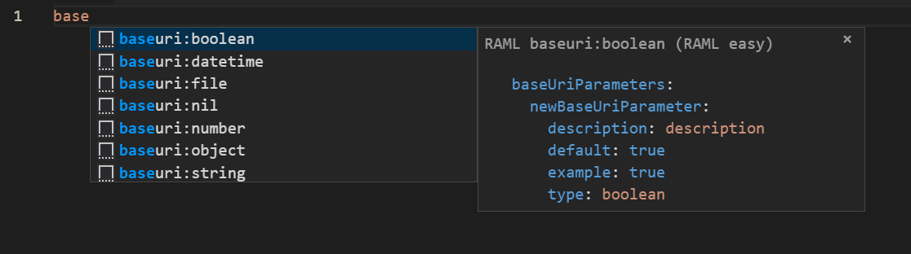

# RAML Easy README

This snippet will help you code faster and better RAML files.

## Features

Snippets for all your needs:

## Release Notes

Currently under development, we will keep adding snnipets :) 

### 1.0.0

Initial release of RAML snnipets

Including RAML Top, Response codes, Endpoints and more.

### 1.0.1

1) Error code snippets added: 
    200, 202, 204, 400, 401, 404, 405, 406, 415, 500.

2) Base URI parameters:
    -Object
    -String
    -Number
    -Boolean
    -DateTime
    -File
    -Nil

-----------------------------------------------------------------------------------------------------------

## Working with Markdown

* Press `Ctrl+Space` (Windows, Linux) or `Cmd+Space` (macOS) to see a list of Markdown snippets.
* The language has to be set to YAML which is the base from RAML.

### For more information

* [Visual Studio Code's Markdown Support](http://code.visualstudio.com/docs/languages/markdown)
* [Markdown Syntax Reference](https://help.github.com/articles/markdown-basics/)

**Enjoy!**
