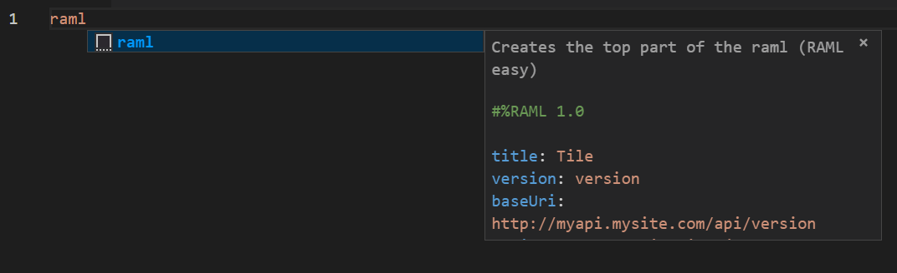

# RAML Easy README

This snnipet will help you code faster and better RAML files.

## Features

Snnipets for all your needs:

## Release Notes

Currently under development, we will keep adding snnipets :) 

### 1.0.0

Initial release of RAML snnipets

Including RAML Top, Response codes, Endpoints and more.

-----------------------------------------------------------------------------------------------------------

## Working with Markdown

* Press `Ctrl+Space` (Windows, Linux) or `Cmd+Space` (macOS) to see a list of Markdown snippets

### For more information

* [Visual Studio Code's Markdown Support](http://code.visualstudio.com/docs/languages/markdown)
* [Markdown Syntax Reference](https://help.github.com/articles/markdown-basics/)

**Enjoy!**
